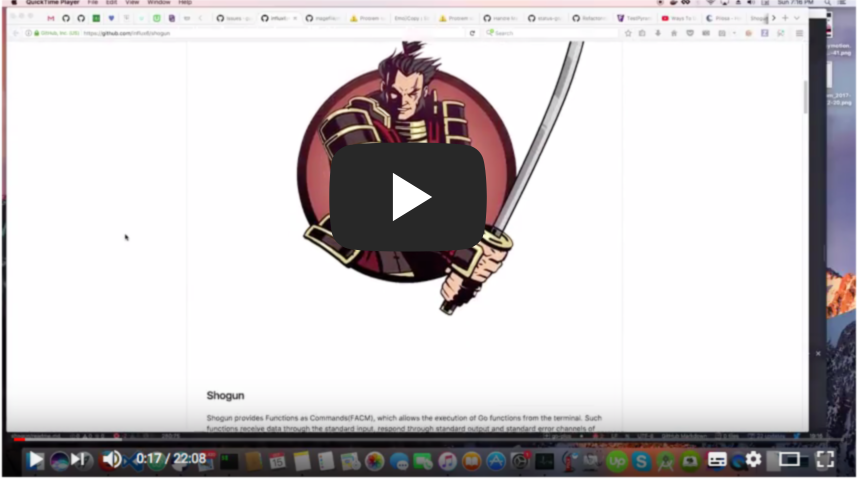

Shogun
---------

Shogun provides Functions as Commands(FACM), which allows the execution of Go functions from the terminal.
Such functions receive data through the standard input, respond through standard output and standard error
channels of your termianl or pty terminal.

Shogun also creates project files and binaries for all packages, which lets you
quickly generate Go binaries for your functions, which can be moved and run anywhere
individually.

*Inspired by [mage](https://github.com/magefile/mage) and [Amazon Lambda functions](http://docs.aws.amazon.com/lambda/latest/dg/lambda-introduction-function.html) as Runnable items*

*Shogun follows the strict requirement that every information to be received by a function must
come through the standard input file `stdin`, this ensures you can pass arbitrary data in or even
JSON payloads to be loaded into a `Struct` type.*

*More so, all response must either be an error returned which will be delivered through
the standard error file `stderr` or be a response written to a `io.WriteCloser` to deliver
to the standard output file `stdout`.*


## Introduction and Demo Video

[](https://youtu.be/GsHBB_xyFTY)

## Install

```bash
go install -u github.com/influx6/shogun
```

Then run `shogun` to validate successful install:

```bash
> shogun
⠙ Nothing to do...

⡿ Run `shogun -h` to see what it takes to make me work.
```

## Requirements

Shogun only requires that you have a working installation of Go (>= 1.2) installed with your `GOPATH` set accordingly.

## Writing Shogun Packages

Writing Go package which are to be used by Shogun to generate binaries are rather simple,
and only require that each package has all it files tagged with the following build tag above
it's package declaration with space in between:

```
// +build shogun

package something
```

Your are free to use any other build tag as well and will be sorted accordingly.

Shogun by default will save binaries into the `GOBIN` or `GOPATH/bin` path extracted
from the environment, however this can be changed by setting a `SHOGUNBIN` environment
variable. More so, Shogun names all binaries the name of the parent package unless one
declares an explicit annotation `@binaryName` at the package level.

```
// +build shogun

// Package do does something.
//
//@binaryName(name => shogunate_bin)
package do
```

If you wished to add a description for the binary command, we can add a `desc` attribute
in a json block of the `@binaryName` annotation.

```
// +build shogun

/* Package do does something.

@binaryName(asJSON, name => shogunate_bin, {
  {
    "desc": "shogunate_bin provides a nice means"
  }
})
*/
package do
```

All binaries created by shogun are self complete and can equally be called directly without
the `shogun` command, which makes it very usable for easy deployable self contained binaries
that can be used in place where behaviors need to be exposed as functions.

Shogun packages are normal Go packages and all directories within the root where shogun
is executed will be parsed and processed for identification of possible shogun packages,
where those identified will each have a binary generated and the main package if any found
will combine all other binaries into a single one if so desired.


### Writing Functions for Shogun

Shogun focuses on the execution of functions, that supports a limited set of formats.
More so, each format allows the use of `Context` or `Context` objects
as first place arguments.

- No Argument Functions

```go
func()
func() error
```

- Context Only Functions

```go
func(Context)
func(Context) error
```

- String based Functions

```go
func(string)
func(string) error
func(Context, string) error
func(Context, string, io.WriteCloser) error
```

- StringSlice based Functions

```go
func([]string)
func([]string) error
func(Context, []string) error
func(Context, []string, io.WriteCloser) error
```

- Map based Functions

```go
func(map[string]interface{})
func(map[string]interface{}) error
func(Context, map[string]interface{}) error
func(Context, map[string]interface{}, io.WriteCloser) error
```

- Struct based Functions

```go
func(Struct)
func(Struct) error
func(Context, Struct) error
func(Struct, io.WriteCloser) error
func(Context, Struct, io.WriteCloser) error
```

- Struct Pointer based Functions

```go
func(*Struct)
func(*Struct) error
func(Context, *Struct) error
func(*Struct, io.WriteCloser) error
func(Context, *Struct, io.WriteCloser) error
```

- Imported Struct based Functions

```go
func(package.Struct)
func(package.Struct) error
func(Context, package.Struct) error
func(package.Struct, io.WriteCloser) error
func(Context, package.Struct, io.WriteCloser) error
```

- Imported Struct Pointer based Functions

```go
func(*package.Struct)
func(*package.Struct) error
func(Context, *package.Struct) error
func(*package.Struct, io.WriteCloser) error
func(Context, *package.Struct, io.WriteCloser) error
```

- io.Reader  based Functions

```go
func(io.Reader)
func(io.Reader) error
func(Context, io.Reader) error
```

- io.Writer based Functions

```go
func(io.WriteCloser)
func(io.WriteCloser) error
func(Context, io.WriteCloser) error
```

- io.Reader and io.Writer based Functions

```go
func(io.Reader, io.WriteCloser)
func(io.Reader, io.WriteCloser) error
func(Context, io.Reader, io.WriteCloser) error
```

*Where `Context` => represents the context package.*

*Where `Struct`   => represents any struct declared in package*

*where `package.Struct` => represents Struct type imported from other package*

*Any other thing beyond this type formats won't be allowed and will be ignored in
function list and execution.*

```go
// +build shogun

// Package katanas provides exported functions as tasks runnable from commandline.
//
// @binaryName(name => katana-shell)
//
package katanas

import (
	"fmt"
	"io"

	"context"
	ty "github.com/influx6/shogun/examples/types"
)

type wondra struct {
	Name string
}

func Draw() {}

// Slash is the default tasks due to below annotation.
// @default
func Slash() error {
	fmt.Println("Welcome to Katana slash!")
	return nil
}

func Bob(ctx context.Context, name string) error {
  fmt.Printf("Welcome to bob %q.\n",name)
	return nil
}

//@flag(name => time, env => JIJA_TIME, type => Duration, desc => specifies time for jija)
func Jija(ctx context.Context, mp ty.Woofer) error {
  jijatime, found := ctx.Bag().GetDuration("time")

	return nil
}
```

In shogun, you can tag a function as the default function to be executed every it's
binary is called without argument through shogun or through it's generated binary, by tagging it with a `@default` annotation.

Shogun also supports function level flags, where a function using annotation can
specify particular flags which it will access from the either the `Context` package
if passed in, except for `Context` which only functions for cancelation.


### Using Context

Only the following packages are allowed for usage. If you need context, then it
must always be the first argument.

- context "context.Context"
- github.com/influx6/fuax/context "context.Context"

When using `context.Context` package from the internal Go packages, only its ability to be used as
a timeout will be set if the `-t` or `-timeout` flag has a value. Support of filling context with values
is not planned or desired.

Shogun will use the `-time` flag received through the commandline to set lifetime
timeout for the 2 giving context else the context will not have expiration deadlines.

Note that shogun by default does not respect `Context` timeouts, it's up to you to
write your function source to take `Context` into account for the lifetime of your function.

## CLI Usage
Before using any other command apart from `shogun list` in a package, always execute:

```bash
> shogun build
```

Shogun by defaults will process both the root and all first level directories that
have shogun files within, generating appropriate binaries based on package name or
if `binaryName` annotation is declared, and will also generate a single binary if
there exists any shogun files within the root directory, with subcommands that will
connect to other binaries in the first level directories.

This allows you to have a single binary that is bundled with all commands for executing functions
from any other subpackage, but this can be changed to only allow single binaries, incase you
want truly separate binaries.

*Note, this only applies, if you have Go files that have the `+build shogun `within the root, where `shogun build` gets executed.*

Shogun will hash shogun files and ensure only when changes occur will a new build be
made and binary will be stored in binary location as dictated by environment
variable `SHOGUNBIN` or default `GOBIN`/`GOPATH/bin` .

---------------------------------------------------------------------------

Using the `shogun` command, we can do the following:

- Build shogun based package files

Run this if the shogun files and directories exists right in the root directory.

```bash
shogun build
```

- Build shogun based package files and remove generated package

```bash
shogun build -rm
```

- Build shogun based package files without generating binaries

Run this if the shogun files and directories exists right in the root directory.

```bash
shogun build -skip
```

- Build a shogun based package files from a directory

```bash
shogun build -d=./examples
```

- Build only shogun based package files into root as packages without main file

```bash
shogun build -nomain
```

- Build shogun based package files binary in directory path

```bash
shogun build -bin=./
```

- Build a shogun based package files in a directory and split binaries as single

```bash
shogun build -single -d=./examples -cmd=./cmd
```

- Build a shogun based package files in a directory and store generated packages in directory `cmd`

```bash
shogun build -d=./examples -cmd=./cmd
```

- Build a shogun based package files in a directory without generating binaries

```bash
shogun build -skip -d=./examples
```

- Force rebuild a shogun based package files in a directory

```bash
shogun build -f -d=./examples
```

- Add new shogun file to current package

```bash
shogun add vuz.go
```

- Add new shogun file into a directory in current package

```bash
shogun add -dir=vuz vuz.go
```

- Add new shogun files into package

```bash
shogun add vuz.go ball.go wreck.go
```

*You can also add more files into a directory when using `-dir` flag in this manner.*

- Add new shogun files into package but use `main` as package name

```bash
shogun add -m vuz.go
```

- List all functions in the root

```bash
shogun list
```

- List all functions in from a directory

```bash
shogun list -dir=./examples
```

- List all functions with short commentary

```bash
shogun help {{BINARYNAME}} {{FunctionName}}
```

- List all functions with full commentary and source

```bash
shogun help -s {{BINARYNAME}} {{FunctionName}}
```

- Run function of package binary that expects no input

```bash
shogun {{BINARYNAME}} {{FUNCTIONNAME}}
```

- Run function of package binary expecting string input with standard input

```bash
echo "We lost the war" | shogun {{BINARYNAME}} {{FUNCTIONNAME}}
```

- Run function of package binary expecting json input with standard input

```bash
{"name":"bat"} | shogun {{BINARYNAME}} {{FUNCTIONNAME}}
```

## FAQ


### Must all commands before run with the `shogun` CLI?

No, every binary that is built is self contained and the `shogun` CLI only proxies
calls to the binary which it expects to be in the `SHOGUNBIN` or `GOBIN`/`GOPATH/bin`.
You can call the binary directly without `shogun` and will work as expected if the path
is added into your environment paths.

### Do I need to re-run `shogun build -dir` on each change ?

With the latest update to shogun, if you have shogun marked package files in
your root directory of your package or within the area where `shogun build` gets
called, then any change will be rebuilt automatically. But for others, you would
need to specifically run `shogun build -dir=''` to build a given directory.


### What differentiates `shogun` from `mage` ?

While `mage` focuses on using Go functions like `make` or `rake` tasks, shogun
expands the usage of functions not just as task runners, but as self contained pure
behaviors that can receive input and respond. This allows you to build commandline
apps quicker with `shogun` and even quickly test out function behaviours.

More so, I envision `shogun` for the purpose of being able to deploy shogun built
binaries into docker images as pure functions, that can be used to support a service
or serve a service like a static file server which only ever runs when needed, ..etc

Of course, you can use `shogun` functions like tasks similar to `mage`, but in effect
that is a side benefit of the approach.

## Contributions
Contributions are welcome, do please checkout the [Contribution Guidlines](./contrib.md).


Logo is a work of [Shadow Fight Wiki](http://shadowfight.wikia.com/wiki/Characters).
